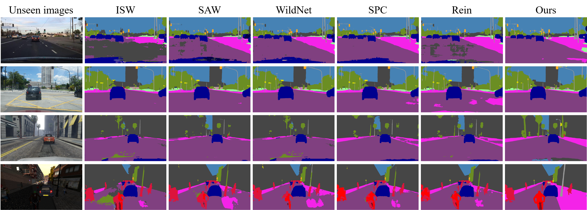

# [ACM MM2024] Learning Spectral-Decomposed Tokens for Domain Generalized Semantic Segmentation
[Jingjun Yi](https://scholar.google.com/citations?user=doRtaBcAAAAJ&hl=en&oi=ao)<sup>1</sup>, [Qi Bi](https://scholar.google.com/citations?user=v6RAqYwAAAAJ&hl=en)<sup>2</sup>, Hao Zheng<sup>3</sup>, Haolan Zhan<sup>4</sup>, Wei Ji<sup>5</sup>, Yawen Huang<sup>3</sup>, Yuexiang Li<sup>6</sup>, Yefeng Zheng<sup>3</sup> <br />
<sup>1</sup> Wuhan University    <sup>2</sup> University of Amsterdam    <sup>3</sup> Tencent Youtu Lab    <sup>4</sup> Monash University    <sup>5</sup> Yale University    <sup>6</sup> Guangxi Medical University

Project page: https://github.com/JingjunYi/SET

Paper: https://arxiv.org/abs/2407.18568


Spectral-dEcomposed Token (SET) is a novel framework designed to enhance domain generalized semantic segmentation by decomposing frozen VFM features into phase (content) and amplitude (style) components in the frequency space, allowing learnable tokens to process these components separately. This approach bridges the gap between style variations and static tokens, resulting in state-of-the-art performance in DGSS benckmarks.


## Visualization
Trained on Cityscapes, SET generalizes to unseen domains: BDD, Mapillary, GTAV, Synthia.



## Performance Under Various Settings (DINOv2).
Trained on Cityscapes (C), generalized to BDD (B), Mapillary (M), GTAV (G), Synthia (S).
| Method                | Venue        | → B                       | → M      | → G      | → S      |
|-----------------------|--------------|---------------------------|----------|----------|----------|
| **ResNet based:**      |              |                           |          |          |          |
| IBN \[33\]            | ECCV 2018    | 48.56                     | 57.04    | 45.06    | 26.14    |
| IW \[34\]             | CVPR 2019    | 48.49                     | 55.82    | 44.87    | 26.10    |
| Iternorm \[20\]       | CVPR 2019    | 49.23                     | 56.26    | 45.73    | 25.98    |
| DRPC \[57\]           | ICCV 2019    | 49.86                     | 56.34    | 45.62    | 26.58    |
| ISW \[12\]            | CVPR 2021    | 50.73                     | 58.64    | 45.00    | 26.20    |
| GTR \[37\]            | TIP 2021     | 50.75                     | 57.16    | 45.79    | 26.47    |
| DIRL \[52\]           | AAAI 2022    | 51.80                     | -        | 46.52    | 26.50    |
| SHADE \[60\]          | ECCV 2022    | 50.95                     | 60.67    | 48.61    | 27.62    |
| SAW \[36\]            | CVPR 2022    | 52.95                     | 59.81    | 47.28    | 28.32    |
| WildNet \[62\]        | CVPR 2022    | 50.94                     | 58.79    | 47.01    | 27.95    |
| **Mask2Former based:** |              |                           |          |          |          |
| HGFormer \[16\]       | CVPR 2023    | 53.4                      | 66.9     | 51.3     | 33.6     |
| CMFormer \[1\]        | AAAI 2024    | 59.27                     | 71.10    | 58.11    | 40.43    |
| **VFM based:**         |              |                           |          |          |          |
| REIN \[51\]           | CVPR 2024    | 63.54                     | 74.03    | 62.41    | 48.56    |
| **Ours**              | MM 2024      | **65.07**                 | **75.67**| **63.80**| **49.61**|
|                       |              | ↑1.53                     | ↑1.64    | ↑1.39    | ↑1.05    |

Trained on Cityscapes (C), generalized to ACDC bad weather scenes Fog, Night, Rain, Snow.
| Method             | Venue        | → Fog   | → Night | → Rain  | → Snow  |
|--------------------|--------------|---------|---------|---------|----------|
| ResNet based:       |              |         |         |         |         |
| IBN* [33]           | ECCV 2018    | 63.8    | 21.2    | 50.4    | 49.6    |
| IW* [34]            | CVPR 2019    | 62.4    | 21.8    | 52.4    | 47.6    |
| ISW* [12]           | CVPR 2021    | 64.3    | 24.3    | 56.0    | 49.8    |
| Mask2Former based:  |              |         |         |         |         |
| ISSA* [27]          | WACV 2023    | 67.5    | 33.2    | 55.9    | 52.3    |
| CMFormer* [1]       | AAAI 2024    | 77.8    | 37.3    | 66.7    | 64.3    |
| VFM based:          |              |         |         |         |         |
| Rein† [51]          | CVPR 2024    | 79.48   | 55.92   | 72.45   | 70.57   |
| **Ours**            | MM 2024      | **80.06** | **57.29** | **74.80** | **73.69** |
|                    |              | ↑0.58   | ↑1.37   | ↑2.35   | ↑3.12   |

  
## Environment Setup
To set up your environment, execute the following commands:
```bash
conda create -n set -y
conda activate set
conda install pytorch==2.0.1 torchvision==0.15.2 torchaudio==2.0.2 pytorch-cuda=11.7 -c pytorch -c nvidia -y
pip install -U openmim
mim install mmengine
mim install "mmcv>=2.0.0"
pip install "mmsegmentation>=1.0.0"
pip install "mmdet>=3.0.0"
pip install xformers=='0.0.20' # optional for DINOv2
pip install -r requirements.txt
pip install future tensorboard
```

## Dataset Preparation
The Preparation is similar as our former work [CMFormer](https://github.com/BiQiWHU/CMFormer). Specifically, all the data is converted to the Cityscapes format.


## Pretraining Weights
* **Download:** Download pre-trained weights from [facebookresearch](https://dl.fbaipublicfiles.com/dinov2/dinov2_vitl14/dinov2_vitl14_pretrain.pth) for testing. Place them in the project directory without changing the file name.
* **Convert:** Convert pre-trained weights for training or evaluation.
  ```bash
  python tools/convert_models/convert_dinov2.py checkpoints/dinov2_vitl14_pretrain.pth checkpoints/dinov2_converted.pth
  ```
  (optional for 1024x1024 resolution)
  ```bash
  python tools/convert_models/convert_dinov2.py checkpoints/dinov2_vitl14_pretrain.pth checkpoints/dinov2_converted_1024x1024.pth --height 1024 --width 1024
  ```

  
## Evaluation
  Run the evaluation:
  ```
  python tools/test.py configs/my/citys_rein_dinov2_mask2former_512x512_bs1x4.py exps/exp0429_syn/iter_40000.pth --backbone checkpoints/dinov2_converted.pth
  ```


## Training
Run the training
```
python tools/train.py configs/my/citys_rein_dinov2_mask2former_512x512_bs1x4.py --work-dir exps/exp0322
```


## Acknowledgment
Our implementation is primarily based on the following repositories, with significant influence from Rein. Thanks for their authors.
* [MMSegmentation](https://github.com/open-mmlab/mmsegmentation)
* [Rein](https://github.com/w1oves/Rein)


## Contact
For further information or questions, please contact Jingjun Yi via rsjingjuny@whu.edu.cn or Qi Bi via q.bi@uva.nl.


## Citation
If you find our code or data helpful, please cite our paper:
```bibtex
@article{yi2024learning,
  title={Learning Spectral-Decomposed Tokens for Domain Generalized Semantic Segmentation},
  author={Yi, Jingjun and Bi, Qi and Zheng, Hao and Zhan, Haolan and Ji, Wei and Huang, Yawen and Li, Yuexiang and Zheng, Yefeng},
  journal={arXiv preprint arXiv:2407.18568},
  year={2024}
}
```
